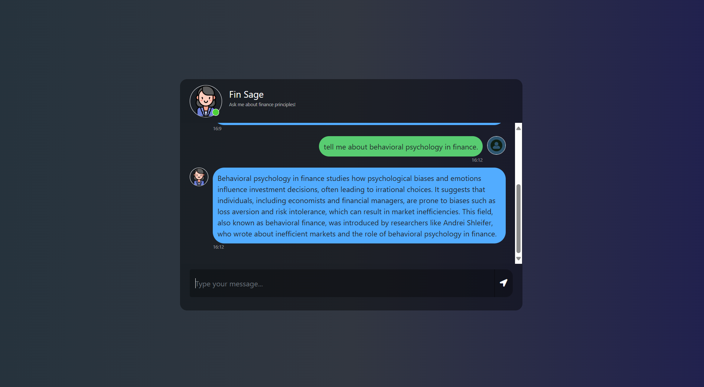
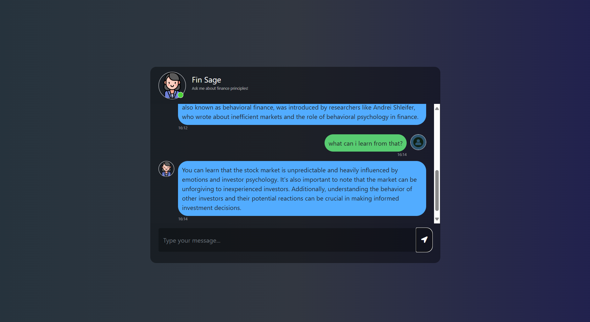

# fin-sage
Financial Advisor Chatbot, RAG-based, powered by Groq

### Output

  


### STEPS:


### 1. Create a conda environment after cloning the repository

```bash
conda create -n fin-sage-cenv python=3.10 -y
```

```bash
conda activate fin-sage-cenv
```


### 2. install the requirements
```bash
pip install -r requirements.txt
```

```bash

python app.py
```

Now,
```bash
open up your localhost:8080
```
